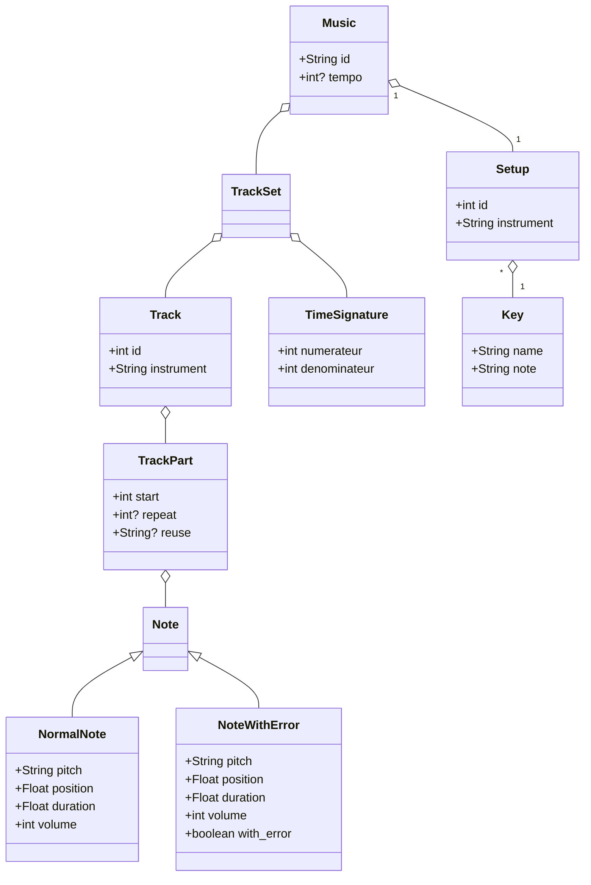

# musicDSL
DSL to create music

# Genere le generator.ts
npm run langium:generate

# Je ne sais pas 
npm run build

# Run un scénario 
./bin/cli.js generate scenarios/test3.music 

# Doc cool 

https://langium.org/tutorials/generation/

# Diagramme de class

