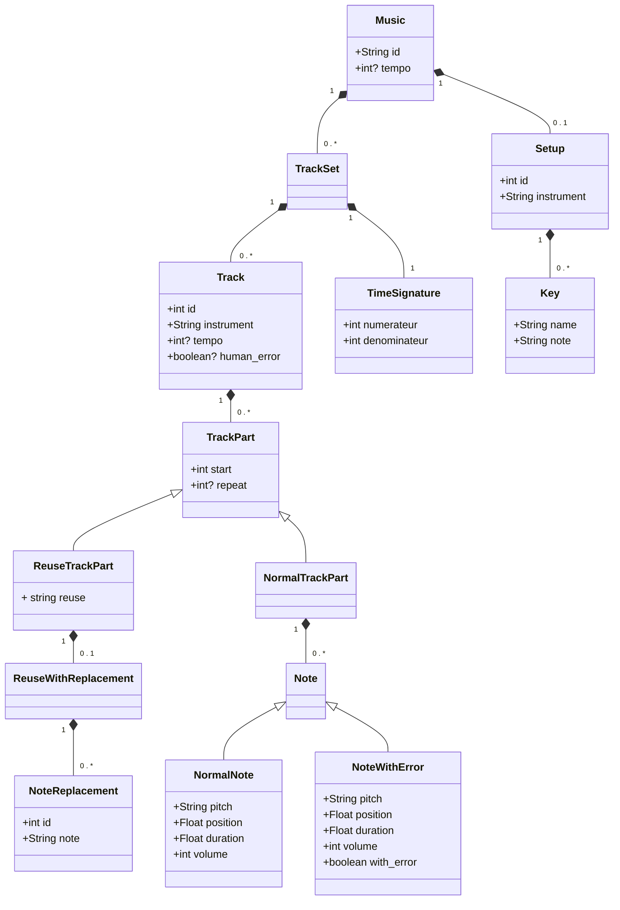

# musicDSL
DSL to create music

npm run langium:generate
npm run build

# Scénario

Les scénarios sont à mettre dans le dossier ./scenarios. L'extention doit être .music

Exemple : my_song.music

# Build un scénario 

Il y a un script qui build les scénarios pour avoir dans le dossier ./output, le fichier .mid correspondant. 

``` bash
./runScenario.sh  NOM_DU_SCENARIO
```

NOM_DU_SCENARIO est le nom du fichier scénario, dans ./scenario.

Exemple : ./runScenario my_song

# Documentation languim 

https://langium.org/tutorials/generation/


# Diagramme de class


