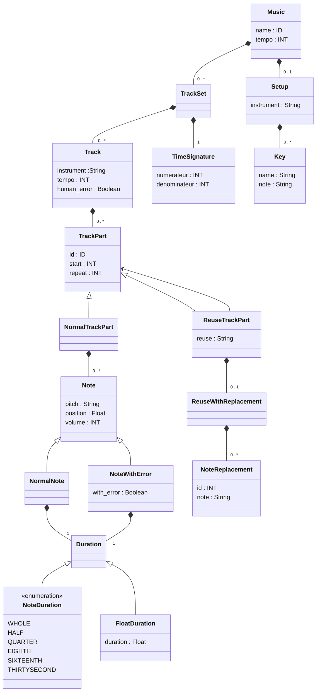

# Musicae

1) Pour compiler le DSL, il faut lancer les deux  commandes suivantes : 

    npm run langium:generate
    npm run build

2) Ensuite il faut installer les libraires  suivantes : 

    pip install MIDIUtil
    pip install pygame
    pip install pynput

# Scénario

Les scénarios sont à mettre dans le dossier ./scenarios. L'extention doit être .music

Exemple : my_song.music

# Build un scénario 

Pour executer un scénario il suffit de lancer le script suivant en passant en paramètre le nom du fichier de scénario ( sans extension et sans path ). 

``` bash
./runScenario.sh  NOM_DU_SCENARIO
```
Le fichier .mid de sortie sera placé dans le dossier ./output

Vous pouvez trouvez le fichier python intérmediare dans le dossier ./generated 


Exemple : ./runScenario my_song

## Add-on

### Autoplay

Il est possible de jouer le fichier midi après sa génération.

Pour ce faire, il faut ajouter l'argument "-p" au lancement du script.

```bash
./runScenario.sh -p  NOM_DU_SCENARIO
```

### Extension vscode : 

Cette extension ne marche que avec l'IDE Vscode de microsoft

- `npm i --save-dev esbuild`
- `npm install -g @vscode/vsce`
- Run `vsce package` to package the extension.
  
Ensuite, un fichier portant le nom musicae-0.0.1.vsix sera créé dans le répertoire principal. Faites un clic droit dessus et sélectionnez "Installer l'extension VSIX".

# Add-on 

# Documentation languim 

https://langium.org/tutorials/generation/


# Diagramme de class


