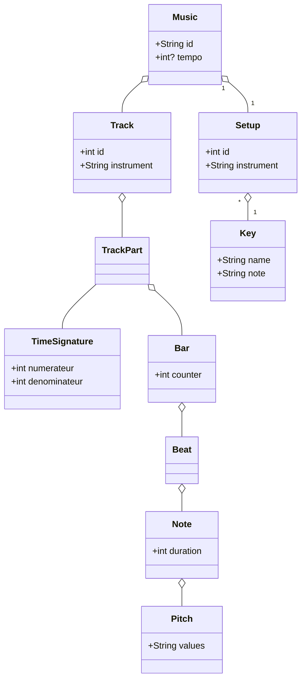

# musicDSL
DSL to create music

# Genere le generator.ts
npm run langium:generate

# Je ne sais pas 
npm run build

# Run un scénario 
./bin/cli.js generate scenarios/test3.music 

# Doc cool 

https://langium.org/tutorials/generation/

# Diagramme de class

# How to use the extension

- `npm i --save-dev esbuild`
- `npm install -g @vscode/vsce`
- Run `vsce package` to package the extension.
Then, a file name musicae-0.0.1.vsix will be create in the root directory. Right click on then and select "Install Extension VSIX"